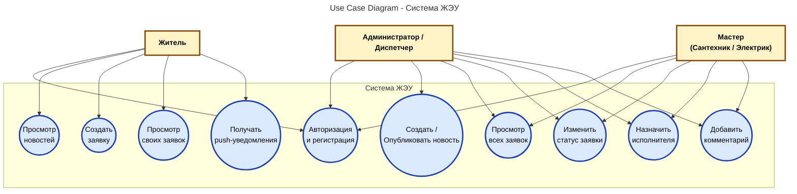
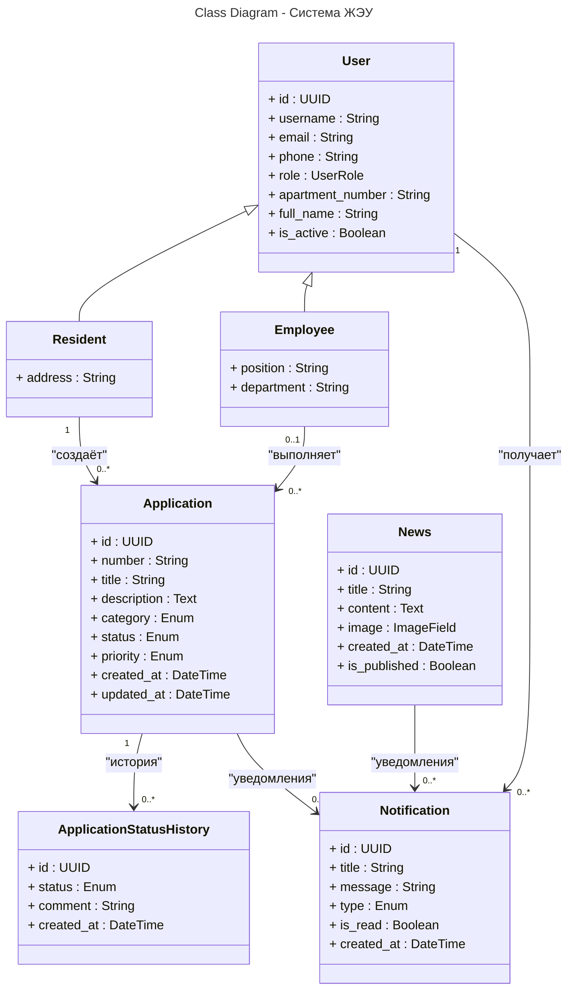

# Система ЖЭУ — Взаимодействие жителей и управляющей компании

## Архитектура проекта

### 1. Use Case Diagram (Диаграмма прецедентов)

### 2. Class Diagram - Система ЖЭУ

**Диаграммы являются актуальными на момент последнего обновления. По мере развития проекта они могут обновляться.**