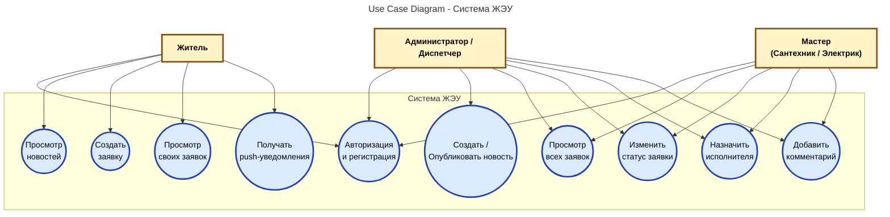
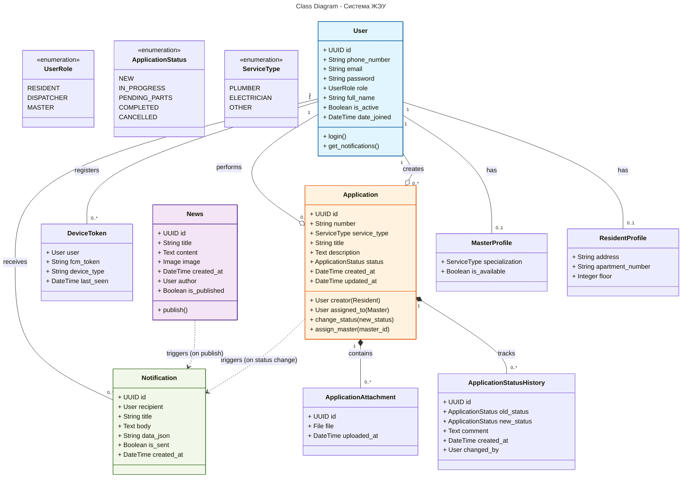

# Система ЖЭУ — Взаимодействие жителей и управляющей компании

## Архитектура проекта

### 1. Use Case Diagram (Диаграмма прецедентов)


```mermaid
---
title: Use Case Diagram - Система ЖЭУ
---

flowchart TD
    %% Актёры
    Resident["Житель"] 
    Admin["Администратор / Диспетчер"] 
    Master["Мастер\n(Сантехник / Электрик)"] 

    %% Система
    subgraph "Система ЖЭУ"
        direction TB
        
        UC1((Авторизация<br>и регистрация))
        UC2((Просмотр<br>новостей))
        UC3((Создать<br>заявку))
        UC4((Просмотр<br>своих заявок))
        UC5((Получать<br>push-уведомления))
        
        UC6((Создать /<br>Опубликовать новость))
        UC7((Просмотр<br>всех заявок))
        UC8((Изменить<br>статус заявки))
        UC9((Назначить<br>исполнителя))
        UC10((Добавить<br>комментарий))
    end

    %% Связи
    Resident --> UC1
    Resident --> UC2
    Resident --> UC3
    Resident --> UC4
    Resident --> UC5

    Admin --> UC1
    Admin --> UC6
    Admin --> UC7
    Admin --> UC8
    Admin --> UC9
    Admin --> UC10

    Master --> UC1
    Master --> UC7
    Master --> UC8
    Master --> UC9
    Master --> UC10

    %% Стили (классический PlantUML вид)
    classDef actor fill:#FEF3C7, stroke:#854D0E, stroke-width:3px, color:#000000, font-weight:bold
    classDef usecase fill:#DBEAFE, stroke:#1E40AF, stroke-width:3px, color:#000000
    
    class Resident,Admin,Master actor
    class UC1,UC2,UC3,UC4,UC5,UC6,UC7,UC8,UC9,UC10 usecase
```
### 2. Class Diagram - Система ЖЭУ


```mermaid
---
title: Class Diagram - Система ЖЭУ
---

classDiagram
    direction TB

    %% ==================== ENUMS ====================
    class UserRole {
        <<enumeration>>
        RESIDENT
        DISPATCHER
        MASTER
    }

    class ApplicationStatus {
        <<enumeration>>
        NEW
        IN_PROGRESS
        PENDING_PARTS
        COMPLETED
        CANCELLED
    }

    class ServiceType {
        <<enumeration>>
        PLUMBER
        ELECTRICIAN
        OTHER
    }

    %% ==================== CORE / USERS ====================
    class User {
        + UUID id
        + String phone_number
        + String email
        + String password
        + UserRole role
        + String full_name
        + Boolean is_active
        + DateTime date_joined
        + login()
        + get_notifications()
    }

    class ResidentProfile {
        + String address
        + String apartment_number
        + Integer floor
    }

    class MasterProfile {
        + ServiceType specialization
        + Boolean is_available
    }

    User "1" -- "0..1" ResidentProfile : has
    User "1" -- "0..1" MasterProfile : has

    %% ==================== NEWS ====================
    class News {
        + UUID id
        + String title
        + Text content
        + Image image
        + DateTime created_at
        + User author
        + Boolean is_published
        + publish()
    }

    %% ==================== APPLICATIONS (PLEA) ====================
    class Application {
        + UUID id
        + String number
        + ServiceType service_type
        + String title
        + Text description
        + ApplicationStatus status
        + DateTime created_at
        + DateTime updated_at
        + User creator (Resident)
        + User assigned_to (Master)
        + change_status(new_status)
        + assign_master(master_id)
    }

    class ApplicationStatusHistory {
        + UUID id
        + ApplicationStatus old_status
        + ApplicationStatus new_status
        + Text comment
        + DateTime created_at
        + User changed_by
    }

    class ApplicationAttachment {
        + UUID id
        + File file
        + DateTime uploaded_at
    }

    Application "1" *-- "0..*" ApplicationStatusHistory : tracks
    Application "1" *-- "0..*" ApplicationAttachment : contains
    User "1" --o "0..*" Application : creates
    User "1" --o "0..*" Application : performs

    %% ==================== NOTIFICATIONS ====================
    class Notification {
        + UUID id
        + User recipient
        + String title
        + Text body
        + String data_json
        + Boolean is_sent
        + DateTime created_at
    }

    class DeviceToken {
        + User user
        + String fcm_token
        + String device_type
        + DateTime last_seen
    }

    User "1" -- "0..*" DeviceToken : registers
    User "1" -- "0..*" Notification : receives
    Application ..> Notification : triggers (on status change)
    News ..> Notification : triggers (on publish)

    %% ==================== STYLING ====================
    style User fill:#e1f5fe,stroke:#01579b
    style Application fill:#fff3e0,stroke:#e65100
    style News fill:#f3e5f5,stroke:#4a148c
    style Notification fill:#f1f8e9,stroke:#33691e
```
**Диаграммы являются актуальными на момент последнего обновления. По мере развития проекта они могут обновляться.**
```
zheu_system
├─ README.md
├─ apps
│  ├─ applications
│  ├─ core
│  ├─ news
│  └─ notifications
├─ config
│  ├─ __init__.py
│  ├─ asgi.py
│  ├─ settings.py
│  ├─ urls.py
│  └─ wsgi.py
├─ manage.py
├─ requirements.txt
└─ ТЗ для создания системы для ЖЭУ.pdf

```